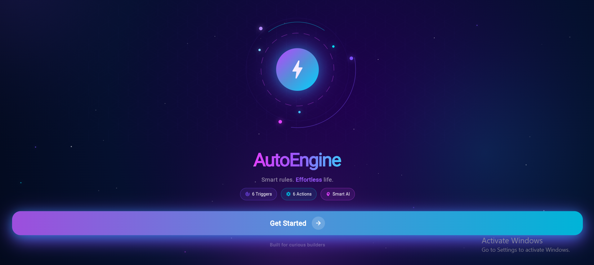
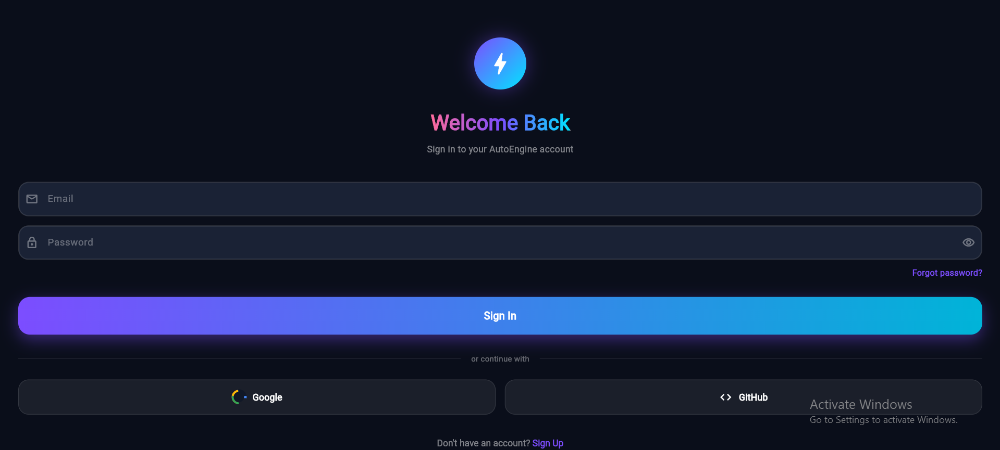
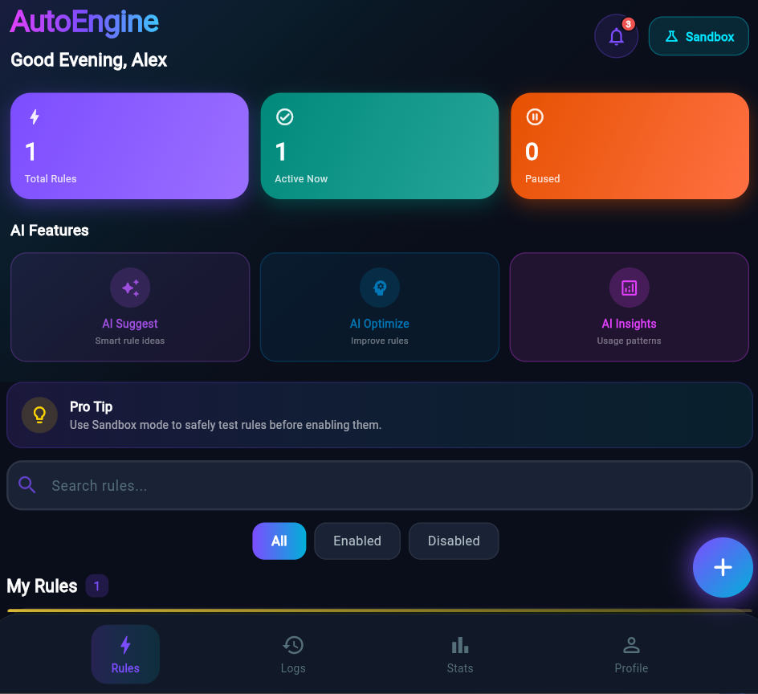
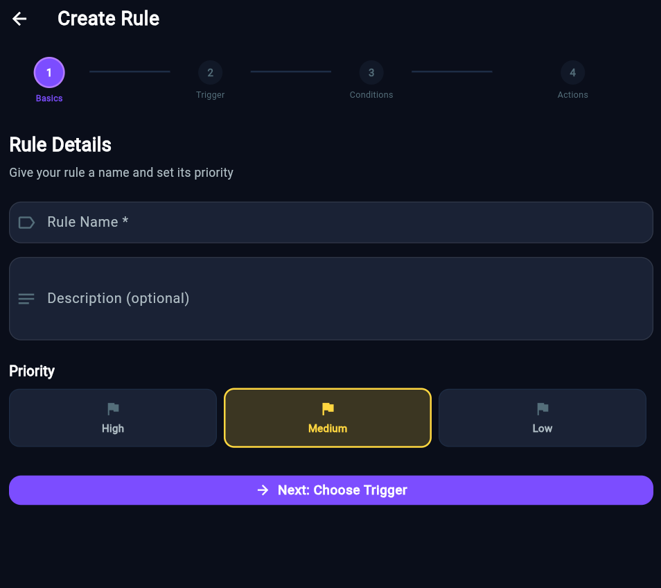
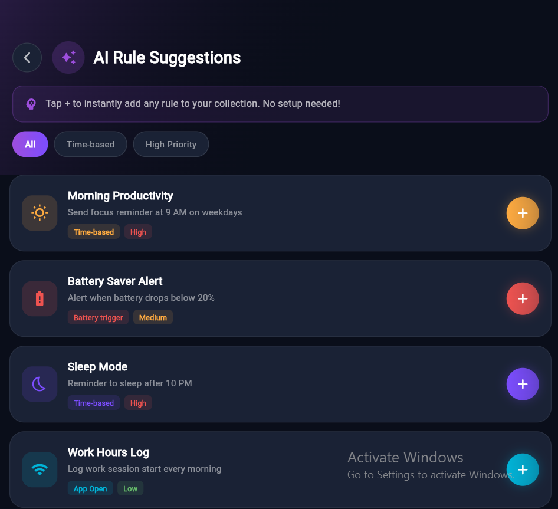
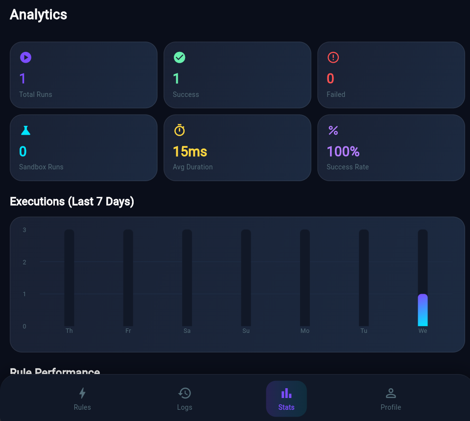
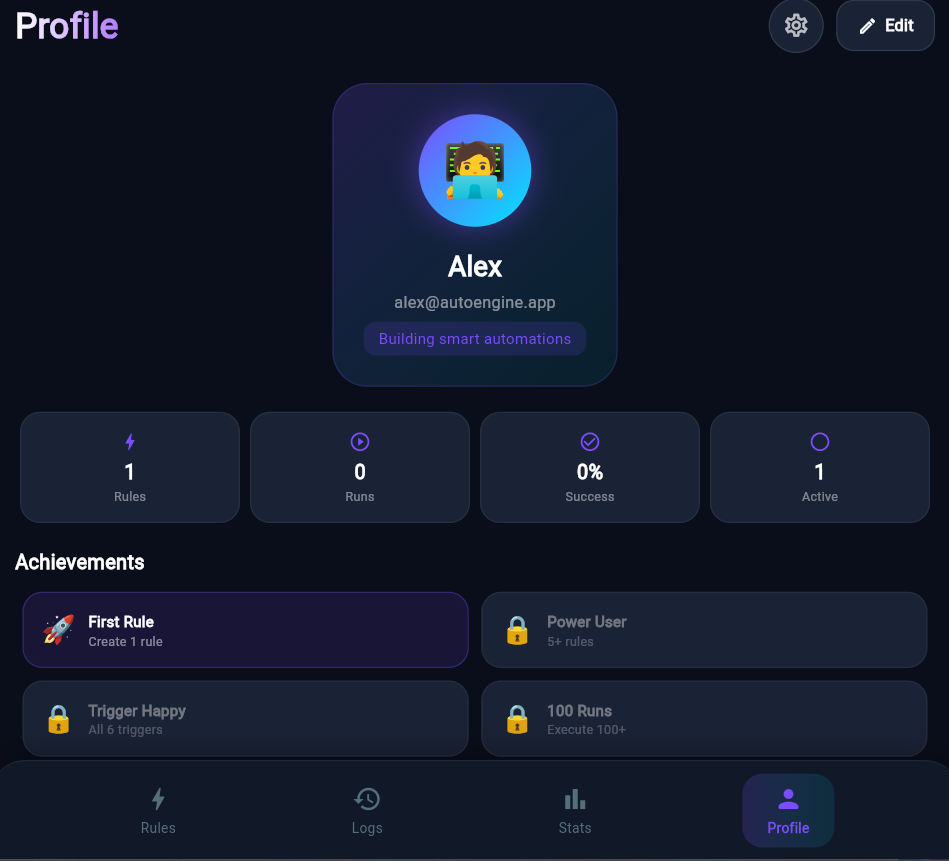

# 🤖 Personal Automation Engine

> A rule-based personal automation app built with Flutter & Firebase — create IF-THEN rules that automatically execute actions based on triggers like time, battery, connectivity, and more.

---

## 🌐 Live Demo

**🔗 [https://personal-automation-engine.web.app](https://personal-automation-engine.web.app)**

> Sign in with Google, GitHub, or Email to start automating!

---

## 📸 Screenshots

| Splash Screen | Login Screen |
|---|---|
|  |  |

| Dashboard | Create Rule |
|---|---|
|  |  |

| AI Suggestions | Analytics |
|---|---|
|  |  |

| Profile |  |
|---|---|
|  | |

## 📋 Table of Contents

- [Overview](#overview)
- [Features](#features)
- [Architecture](#architecture)
- [Tech Stack](#tech-stack)
- [Design Decisions](#design-decisions)
- [Project Structure](#project-structure)
- [Rule Engine](#rule-engine)
- [Firebase Integration](#firebase-integration)
- [Authentication](#authentication)
- [Setup & Installation](#setup--installation)
- [Deployment](#deployment)

---

## 🎯 Overview

Personal Automation Engine is a **cross-platform automation app** that lets users create smart rules without any coding. Think of it like **Apple Shortcuts** or **IFTTT** — but built from scratch using Flutter.

A rule consists of:
```
TRIGGER  →  CONDITIONS (optional)  →  ACTIONS
  ↓                ↓                     ↓
"When..."      "Only if..."          "Then do..."
```

**Example:**
```
Trigger:    Every day at 9:00 AM
Condition:  Only on weekdays
Action:     Show notification "Time to focus! 🚀"
```

---

## ✨ Features

### 🔐 Authentication
- Google OAuth Sign-in (real Firebase popup)
- GitHub OAuth Sign-in (real Firebase popup)
- Email & Password Sign-up / Sign-in
- Forgot Password (sends real reset email)
- Session persistence (stay logged in after refresh)
- Per-user data isolation in Firebase

### ⚡ Rule Engine — 6 Triggers
| Trigger | Description |
|---------|-------------|
| ⏰ Time | Fires at a specific time every day |
| 📱 App Open | Fires every time the app is opened |
| 🔘 Manual | Fires when user taps the Run button |
| 🔋 Battery | Fires when battery drops below a threshold |
| 📶 Connectivity | Fires when WiFi connects or disconnects |
| ⏱️ Interval | Fires every X minutes |

### 🎯 6 Actions
| Action | Description |
|--------|-------------|
| 🔔 Notification | Shows a browser/system notification |
| 💬 Display Message | Shows a popup dialog or snackbar |
| 📝 Log Entry | Saves a log entry to Firebase |
| 🔊 Play Sound | Plays a sound via Web Audio API |
| 📋 Copy to Clipboard | Copies text to clipboard |
| 🌐 Call Webhook | Makes an HTTP request to any URL |

### 🧠 3 Conditions
| Condition | Description |
|-----------|-------------|
| 🕐 Time Range | Only run between certain hours |
| 📅 Day of Week | Only run on specific days |
| 🔢 Counter | Only run after N executions |

### 📊 Other Features
- **Real-time sync** — rules & logs sync instantly via Firebase
- **AI Rule Suggestions** — one-tap add pre-built smart rules
- **Analytics Dashboard** — charts showing execution stats
- **Sandbox Mode** — test rules without executing real actions
- **Conflict Detection** — warns when rules might conflict
- **Rule Priority** — High / Medium / Low priority ordering
- **Execution Logs** — full history of every rule run
- **Alerts Center** — notifications with Clear All support
- **Dark Mode UI** — glassmorphism design with neon gradients
- **Export / Import** — backup rules as JSON

---

## 🏗️ Architecture

The app follows a **clean layered architecture**:

```
┌─────────────────────────────────────────┐
│              UI Layer                    │
│   Screens → Widgets → Animations        │
├─────────────────────────────────────────┤
│           State Management               │
│     Flutter Riverpod (Providers)        │
├─────────────────────────────────────────┤
│            Service Layer                 │
│  FirebaseService │ AnalyticsService     │
│  SoundService    │ NotificationService  │
├─────────────────────────────────────────┤
│             Engine Layer                 │
│  Triggers → Conditions → Actions        │
├─────────────────────────────────────────┤
│             Data Layer                   │
│  Firebase Realtime DB │ Hive (local)    │
└─────────────────────────────────────────┘
```

### Data Flow:
```
User creates rule
      ↓
RulesNotifier (Riverpod)
      ↓
FirebaseService.saveRule()
      ↓
Firebase Realtime Database
      ↓
Stream updates all listeners
      ↓
UI rebuilds automatically
```

---

## 🛠️ Tech Stack

| Technology | Purpose | Version |
|-----------|---------|---------|
| **Flutter** | UI Framework | 3.x |
| **Dart** | Programming Language | 3.x |
| **Firebase Auth** | Authentication | ^4.17.9 |
| **Firebase Realtime DB** | Real-time Database | ^10.4.9 |
| **Firebase Hosting** | Web Deployment | Latest |
| **Flutter Riverpod** | State Management | ^2.4.9 |
| **Google Sign In** | OAuth | ^6.2.1 |
| **Hive** | Local Storage | ^2.2.3 |
| **FL Chart** | Analytics Charts | ^0.66.2 |
| **UUID** | Unique IDs | ^4.3.3 |

---

## 🎨 Design Decisions

### 1. Flutter for Cross-Platform
**Decision:** Use Flutter instead of native Android/iOS or React Native.

**Reason:**
- Single codebase for Web + Android + iOS
- Rich animation support for glassmorphism UI
- Strong type safety with Dart
- Excellent Firebase SDK support

### 2. Firebase Realtime Database over Firestore
**Decision:** Use Realtime Database instead of Firestore.

**Reason:**
- Free tier available without billing enabled
- Real-time streaming built-in
- Simpler JSON structure fits our rule model perfectly
- Lower latency for live sync

### 3. Riverpod for State Management
**Decision:** Use Riverpod over Provider, Bloc, or GetX.

**Reason:**
- Compile-safe — no runtime errors from missing providers
- Stream-based — perfect for Firebase real-time listeners
- No BuildContext required — works anywhere in code
- Easy to test

### 4. Hybrid Storage (Firebase + Hive)
**Decision:** Use both Firebase (cloud) and Hive (local) together.

**Reason:**
- Firebase handles auth & cross-device sync
- Hive handles local rule execution engine
- App works offline with cached data
- Best of both worlds

### 5. Dark Glassmorphism UI
**Decision:** Dark theme with neon purple/cyan gradients.

**Reason:**
- Automation apps feel more "technical" with dark themes
- Glassmorphism gives premium feel
- Neon colors provide clear visual hierarchy
- Matches the "smart/AI" brand identity

### 6. Rule Engine Design Pattern
**Decision:** Strategy pattern for triggers and actions.

**Reason:**
- Each trigger/action is an independent class
- Easy to add new triggers without changing existing code
- Open/Closed Principle — open for extension, closed for modification
- Clean separation of concerns

```dart
// Example: Adding a new trigger is just adding one class
class LocationTrigger extends BaseTrigger {
  @override
  Future<bool> shouldFire() async {
    // check location logic
  }
}
```

---

## 📁 Project Structure

```
lib/
├── main.dart                    # App entry point + Firebase init
├── firebase_options.dart        # Auto-generated Firebase config
│
├── core/
│   ├── constants/
│   │   └── app_constants.dart   # Trigger/action type constants
│   └── theme/
│       └── app_theme.dart       # Dark theme + colors
│
├── data/
│   ├── models/
│   │   ├── rule_model.dart      # Core rule data model
│   │   ├── trigger_model.dart   # Trigger type + params
│   │   ├── action_model.dart    # Action type + params
│   │   ├── condition_model.dart # Condition logic
│   │   └── log_model.dart       # Execution log entry
│   ├── local/
│   │   ├── database_helper.dart # Hive initialization
│   │   └── rule_dao.dart        # Local CRUD operations
│   └── repositories/
│       └── rule_repository.dart # Data access layer
│
├── engine/
│   ├── automation_engine.dart   # Core rule executor
│   ├── triggers/
│   │   ├── base_trigger.dart    # Abstract trigger class
│   │   └── triggers.dart        # All 6 trigger implementations
│   ├── conditions/
│   │   └── condition_evaluator.dart
│   └── actions/
│       ├── base_action.dart     # Abstract action class
│       └── actions.dart         # All 6 action implementations
│
├── providers/
│   └── providers.dart           # Riverpod state providers
│
├── services/
│   ├── firebase_service.dart    # Firebase Auth + DB wrapper
│   ├── analytics_service.dart   # Stats computation
│   ├── notification_service.dart
│   ├── sound_service.dart       # Web Audio API
│   └── json_export_service.dart # Export/Import rules
│
└── ui/
    ├── screens/
    │   ├── splash_screen.dart   # Animated splash
    │   ├── login_screen.dart    # Auth screen
    │   ├── signup_screen.dart   # Registration
    │   ├── home_screen.dart     # Rules dashboard
    │   ├── create_rule_screen.dart
    │   ├── analytics_screen.dart
    │   ├── logs_screen.dart
    │   ├── alerts_screen.dart
    │   ├── sandbox_screen.dart
    │   ├── profile_screen.dart
    │   ├── settings_screen.dart
    │   ├── ai_suggest_screen.dart
    │   ├── ai_insights_screen.dart
    │   └── ai_optimize_screen.dart
    └── widgets/
        └── (reusable components)
```

---

## ⚙️ Rule Engine

The automation engine uses a **pipeline pattern**:

```
1. TRIGGER CHECK
   └── Does this trigger apply right now?
         ↓ YES
2. CONDITION EVALUATION
   └── Are all conditions met?
         ↓ YES
3. ACTION EXECUTION
   └── Execute each action in sequence
         ↓
4. LOG RESULT
   └── Save to Firebase with success/fail status
```

### Trigger Implementation Example:
```dart
class TimeTrigger extends BaseTrigger {
  @override
  Future<bool> shouldFire() async {
    final configTime = model.parameters['time'] as String;
    final now = TimeOfDay.now();
    final parts = configTime.split(':');
    final triggerHour = int.parse(parts[0]);
    final triggerMin = int.parse(parts[1]);
    return now.hour == triggerHour && now.minute == triggerMin;
  }
}
```

---

## 🔥 Firebase Integration

### Database Structure:
```json
{
  "users": {
    "USER_UID": {
      "profile": {
        "name": "Alex",
        "email": "alex@example.com",
        "avatar": "🧑‍💻",
        "createdAt": "2024-01-01T00:00:00Z"
      },
      "rules": {
        "RULE_ID": {
          "id": "uuid",
          "name": "Morning Reminder",
          "isEnabled": true,
          "trigger": { "type": "time", "parameters": { "time": "09:00" } },
          "conditions": [],
          "actions": [{ "type": "notification", "parameters": { "title": "Good morning!" } }],
          "createdAt": "2024-01-01T00:00:00Z",
          "priority": 1
        }
      },
      "logs": {
        "LOG_ID": {
          "ruleId": "uuid",
          "ruleName": "Morning Reminder",
          "success": true,
          "message": "Rule executed successfully",
          "durationMs": 23,
          "executedAt": "2024-01-01T09:00:00Z"
        }
      }
    }
  }
}
```

### Security Rules:
```json
{
  "rules": {
    "users": {
      "$uid": {
        ".read": "$uid === auth.uid",
        ".write": "$uid === auth.uid"
      }
    }
  }
}
```

---

## 🔐 Authentication

Three sign-in methods supported:

```
1. Google OAuth
   User clicks "Sign in with Google"
         ↓
   Firebase opens Google popup
         ↓
   User selects Google account
         ↓
   Firebase returns UserCredential
         ↓
   App navigates to HomeScreen

2. GitHub OAuth
   (Same flow with GitHub popup)

3. Email / Password
   User enters email + password
         ↓
   Firebase Auth validates
         ↓
   App navigates to HomeScreen
```

---

## 🚀 Setup & Installation

### Prerequisites:
- Flutter SDK 3.x
- Node.js + npm
- Firebase CLI
- Git

### Steps:

```bash
# 1. Clone the repository
git clone https://github.com/yourusername/personal_automation_engine
cd personal_automation_engine

# 2. Install dependencies
flutter pub get

# 3. Configure Firebase (already done — firebase_options.dart included)

# 4. Run locally
flutter run -d chrome

# 5. Run on Android
flutter run -d android
```

---

## 🌐 Deployment

### Deploy to Firebase Hosting:

```bash
# Build web version
flutter build web

# Deploy to Firebase
firebase deploy
```

### Live URL:
```
https://personal-automation-engine.web.app
```

### Update Deployment:
```bash
# After making changes:
flutter build web && firebase deploy
```

---

## 👨‍💻 Author

**Built for College Club Admission Task**

- Platform: Flutter Web + Android
- Backend: Firebase (Auth + Realtime Database + Hosting)
- Design: Dark glassmorphism with neon gradients

---

## 📄 License

This project is built for educational purposes as part of a college club submission.

---

*Built with ❤️ using Flutter & Firebase*
